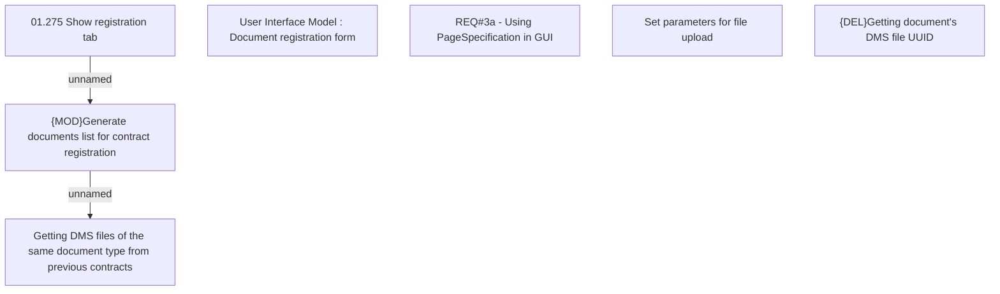

# CBL-8156 (CSI-164) Integration with Inovatrics - using PageSpecification in GUI (step3a)

```mermaid
graph TD
    n_01_275_Show_registration_tab["01.275 Show registration tab"]
    Getting_DMS_files_of_the_same_document_type_from_previous_co["Getting DMS files of the same document type from previous contracts"]
    MOD_Generate_documents_list_for_contract_registration["{MOD}Generate documents list for contract registration"]
    User_Interface_Model_Document_registration_form["User Interface Model : Document registration form"]
    REQ_3a_Using_PageSpecification_in_GUI["REQ#3a - Using PageSpecification in GUI"]
    Set_parameters_for_file_upload["Set parameters for file upload"]
    DEL_Getting_document_s_DMS_file_UUID["{DEL}Getting document's DMS file UUID"]
    n_01_275_Show_registration_tab -->|unnamed| MOD_Generate_documents_list_for_contract_registration
    MOD_Generate_documents_list_for_contract_registration -->|unnamed| Getting_DMS_files_of_the_same_document_type_from_previous_co
```
