# CBL-8156 (CSI-172) Integration with Inovatrics - using PageSpecification in API (step3b)

- **Diagram Type**: Custom
- **Package**: HomerSelect/BSL/Requirements Model/Finished/CLM/CBL-8156 (CLM-2783) Integration with Inovatrics
- **Diagram ID**: 144817
- **Elements**: 17
- **Connectors**: 2

```mermaid
graph TD
    DEL_01_276_Get_documents_for_registration_checking_service["{DEL}01.276 Get documents for registration checking service"]
    SetDocumentProofCheckRequest_validation["SetDocumentProofCheckRequest validation"]
    n_01_792_Set_Document_ProofCheck_service["01.792 Set Document ProofCheck service"]
    SettingDocumentProofCheck_v3_ADD_SettingDocumentProofCheck_v["SettingDocumentProofCheck_v3 :{ADD}SettingDocumentProofCheck_v3"]
    MOD_SetDocumentFileRequest_validation["{MOD}SetDocumentFileRequest validation"]
    n_01_791_Set_Document_File_service["01.791 Set Document File service"]
    n_01_790_Get_Contract_Documents_detail_service["01.790 Get Contract Documents detail service"]
    SetDocumentFile_v3_ADD_Set_Document_File_v3["SetDocumentFile_v3 : {ADD}Set Document File v3"]
    MOD_01_763_Get_Contract_Documents_for_self_care["{MOD}01.763 Get Contract Documents for self-care"]
    GetContractDocumentsDetail_v3_ADD_Get_Contract_Documents_det["GetContractDocumentsDetail_v3 : {ADD}Get Contract Documents detail v3"]
    MOD_UploadDocumentFileRequest_validations["{MOD}UploadDocumentFileRequest validations"]
    ContractDocuments_v3_ContractDocumentWS_UploadDocumentFile["ContractDocuments_v3 : ContractDocumentWS - UploadDocumentFile"]
    ContractDocuments_v3_ContractDocumentWS_GetDocumentsForRegis["ContractDocuments_v3 : ContractDocumentWS - GetDocumentsForRegistration"]
    ContractDocuments_v3_ContractDocumentWS_GetDocumentList["ContractDocuments_v3 : ContractDocumentWS - GetDocumentList"]
    el_1688736["Text"]
    el_1688731["Text"]
    REQ_3b_Using_PageSpecification_in_APIs["REQ#3b - Using PageSpecification in APIs"]
    n_01_792_Set_Document_ProofCheck_service -->|unnamed| SetDocumentProofCheckRequest_validation
    n_01_791_Set_Document_File_service -->|unnamed| MOD_SetDocumentFileRequest_validation
```

