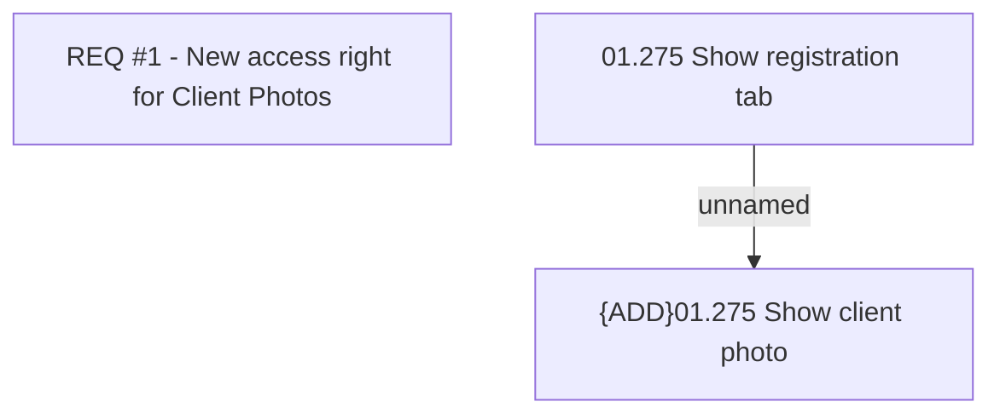

# CBL-8168 (CLM-2554) New access right for Client Photos

- **Diagram Type**: Custom
- **Package**: HomerSelect/BSL/Requirements Model/Finished/CLM/CBL-8168 (CLM-2554) New access right for Client Photos
- **Diagram ID**: 122867
- **Elements**: 3
- **Connectors**: 1

