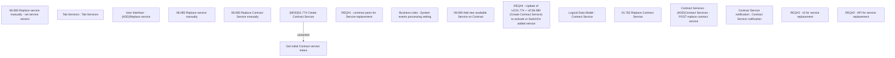

# CBL-8246 (CLM-2557) Implementation of API + UI for service replacement

```mermaid
graph TD
    Get_initial_Contract_service_status["Get initial Contract service status"]
    n_08_085_Replace_service_manually_set_service_version["08.085 Replace service manually - set service version"]
    Tab_Services_Tab_Services["Tab-Services : Tab-Services"]
    User_Interface_ADD_Replace_service["User Interface : {ADD}Replace service"]
    n_08_085_Replace_service_manually["08.085 Replace service manually"]
    n_08_085_Replace_Contract_Service_manually["08.085 Replace Contract Service manually"]
    MOD_01_774_Create_Contract_Service["{MOD}01.774 Create Contract Service"]
    REQ_1_common_parts_for_Service_replacement["REQ#1 - common parts for Service replacement"]
    Business_rules_System_events_processing_setting["Business rules : System events processing setting"]
    n_08_080_Add_new_available_Service_on_Contract["08.080 Add new available Service on Contract"]
    REQ_4_Update_of_UC01_774_UC08_080_Create_Contract_Service_to["REQ#4 - Update of UC01.774 + UC08.080 (Create Contract Service) to activate or SwitchOn added service"]
    Logical_Data_Model_Contract_Service["Logical Data Model : Contract Service"]
    n_01_782_Replace_Contract_Service["01.782 Replace Contract Service"]
    n_01_782_Replace_Contract_Service["01.782 Replace Contract Service"]
    Contract_Services_ADD_Contract_Services_POST_replace_contrac["Contract Services : {ADD}Contract Services - POST replace contract service"]
    Contract_Service_notification_Contract_Service_notification["Contract Service notification : Contract Service notification"]
    REQ_3_UI_for_service_replacement["REQ#3 - UI for service replacement"]
    REQ_2_API_for_service_replacement["REQ#2 - API for service replacement"]
    MOD_01_774_Create_Contract_Service -->|unnamed| Get_initial_Contract_service_status
```
