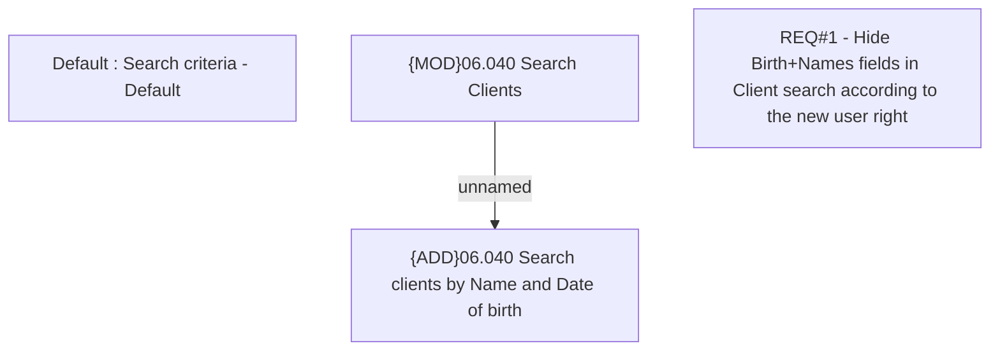

# CBL-8249 (CLM-2591) Search client function: Hide Birth+Name in searching criteria

- **Diagram Type**: Custom
- **Package**: HomerSelect/BSL/Requirements Model/Finished/CLM/CBL-8249 (CLM-2591) Search client function: Hide Birth+Name in searching criteria
- **Diagram ID**: 123526
- **Elements**: 4
- **Connectors**: 1

