# REQ #1 - Add radio buttons Registration and Mistake investigation

- **Diagram Type**: Custom
- **Package**: HomerSelect/BSL/Requirements Model/Finished/CLM/CBL-8291 (CLM-3246) VN - Paperless - contract Registration Queue optimization - Enhancements V3
- **Diagram ID**: 144818
- **Elements**: 24
- **Connectors**: 1

```mermaid
graph TD
    MOD_01_289_Show_registration_queue_management["{MOD}01.289 Show registration queue management"]
    Registration["Registration"]
    Mistake_investigation["Mistake investigation"]
    Check_all["Check all"]
    Assign_next_contract["Assign next contract"]
    Document_registration_form["Document registration form"]
    Assigned_operator["Assigned operator"]
    Registration_status["Registration status"]
    Report_mistakes["Report mistakes"]
    Change_operator["Change operator"]
    Error_message["Error message"]
    Turn_on_barcode_scanning_Scan_document_barcode["Turn on barcode scanning / Scan document barcode"]
    Barcode_scanning_form["Barcode scanning form"]
    Photo["Photo"]
    n_01_275_Show_registration_tab["01.275 Show registration tab"]
    RegistrationDate["RegistrationDate"]
    RegistrationUser["RegistrationUser"]
    RegistrationInfo["RegistrationInfo"]
    Client_photo["Client photo"]
    Check_presence_and_quality_of_all_documents["Check presence and quality of all documents"]
    Register_contract["Register contract"]
    Contract_registration_component["Contract registration component"]
    Register_contract["Register contract"]
    REQ_1_Add_radio_buttons_Registration_and_Mistake_investigati["REQ #1 - Add radio buttons Registration and Mistake investigation"]
    Register_contract -->|unnamed| n_01_275_Show_registration_tab
```

