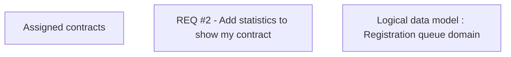

# REQ #2 - Add statistics to show my contract 

- **Diagram Type**: Custom
- **Package**: HomerSelect/BSL/Requirements Model/Finished/CLM/CBL-8291 (CLM-3246) VN - Paperless - contract Registration Queue optimization - Enhancements V3
- **Diagram ID**: 144819
- **Elements**: 3
- **Connectors**: 0

