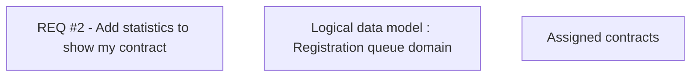

# REQ #2 - Add statistics to show my contract 

```mermaid
graph TD
    REQ_2_Add_statistics_to_show_my_contract["REQ #2 - Add statistics to show my contract "]
    Logical_data_model_Registration_queue_domain["Logical data model : Registration queue domain"]
    Assigned_contracts["Assigned contracts"]
```
