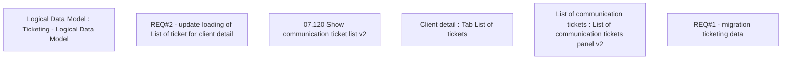

# CBL-8338 (CLM-2563) Client detail - List of ticket optimization

- **Diagram Type**: Custom
- **Package**: HomerSelect/BSL/Requirements Model/Finished/CLM/CBL-8338 (CLM-2563) Client detail - List of ticket optimization
- **Diagram ID**: 121587
- **Elements**: 6
- **Connectors**: 0

