# CBL-8361 (CLM-2575) Optimize access rights for documents download on affected tabs

- **Diagram Type**: Custom
- **Package**: HomerSelect/BSL/Requirements Model/Finished/CLM/CBL-8361 (CLM-2575) Optimize access rights for documents download on affected tabs
- **Diagram ID**: 121559
- **Elements**: 9
- **Connectors**: 7

```mermaid
graph TD
    REQ_1_Optimize_access_rights_for_documents_download_on_affec["REQ #1 - Optimize access rights for documents download on affected tabs"]
    ADD_01_128_Preview_client_document_file_download["{ADD}01.128 Preview client document (file download)"]
    ADD_01_128_Preview_client_document["{ADD}01.128 Preview client document"]
    ADD_01_128_Preview_contract_document_file_download["{ADD}01.128 Preview contract document (file download)"]
    MOD_01_128_Preview_document_status_In_Pre_process["{MOD}01.128 Preview document (status In Pre-process)"]
    MOD_01_128_Preview_document_all_statuses["{MOD}01.128 Preview document (all statuses)"]
    MOD_01_128_Preview_document_file_download["{MOD}01.128 Preview document (file download)"]
    n_01_128_Preview_document["01.128 Preview document"]
    MOD_01_128_Preview_document["{MOD}01.128 Preview document"]
    MOD_01_128_Preview_document -->|unnamed| MOD_01_128_Preview_document_status_In_Pre_process
    MOD_01_128_Preview_document -->|unnamed| MOD_01_128_Preview_document_file_download
    MOD_01_128_Preview_document -->|unnamed| MOD_01_128_Preview_document_all_statuses
    MOD_01_128_Preview_document -->|unnamed| ADD_01_128_Preview_contract_document_file_download
    MOD_01_128_Preview_document -->|unnamed| ADD_01_128_Preview_client_document
    MOD_01_128_Preview_document -->|unnamed| n_01_128_Preview_document
    MOD_01_128_Preview_document -->|unnamed| ADD_01_128_Preview_client_document_file_download
```

