# CBL-8394 (CLM-2583) Extend contract service information window and add service tooltip

- **Diagram Type**: Custom
- **Package**: HomerSelect/BSL/Requirements Model/Finished/CLM/CBL-8394 (CLM-2583)  Extend contract service information window and add service tooltip
- **Diagram ID**: 123110
- **Elements**: 18
- **Connectors**: 1

```mermaid
graph TD
    n_08_090_Terminate_Contract_Service_manually["08.090 Terminate Contract Service manually"]
    REQ_2_Save_Status_Reason_Description_on_service_termination["REQ #2 - Save Status Reason Description on service termination"]
    Service_version["Service version"]
    Service_code["Service code"]
    OK["OK"]
    Service_description["Service description"]
    Service_name["Service name"]
    Service_type["Service type"]
    el_1779854["Boundary"]
    Service_information["Service information"]
    Tab_Services_Tab_Services["Tab-Services : Tab-Services"]
    REQ_2_Add_label_Contract_Service_Service_version_to_Service_["REQ #2 - Add label Contract Service.Service version to Service information modal window"]
    Add_available_services["Add available services"]
    Services["Services"]
    Tab_Services["Tab Services"]
    User_Interface_Show_service_information["User Interface : Show service information"]
    Logical_Data_Model_Contract_Service["Logical Data Model : Contract Service"]
    REQ_1_Implement_tooltip_with_Contract_Service_Status_Reason_["REQ #1 - Implement tooltip with Contract Service.Status Reason Description"]
    Services -->|unnamed| n_08_090_Terminate_Contract_Service_manually
```

