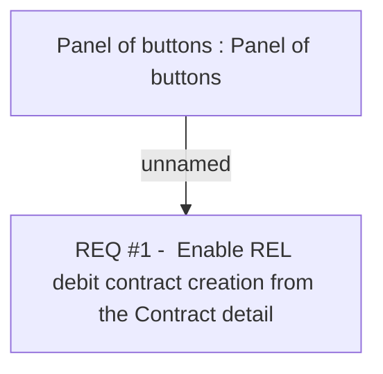

# CBL-8445 (CLM-2615) Autofill of debit card application when applying for a POS loan

- **Diagram Type**: Custom
- **Package**: HomerSelect/BSL/Requirements Model/Finished/CLM/CBL-8445 (CLM-2615) Autofill of debit card application when applying for a POS loan
- **Diagram ID**: 124875
- **Elements**: 2
- **Connectors**: 1

