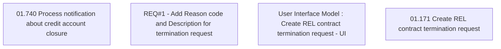

# CBL-8479 (CLM-2730) Add reason to REL termination request

```mermaid
graph TD
    n_01_740_Process_notification_about_credit_account_closure["01.740 Process notification about credit account closure "]
    REQ_1_Add_Reason_code_and_Description_for_termination_reques["REQ#1 - Add Reason code and Description for termination request"]
    User_Interface_Model_Create_REL_contract_termination_request["User Interface Model : Create REL contract termination request - UI"]
    n_01_171_Create_REL_contract_termination_request["01.171 Create REL contract termination request"]
```
