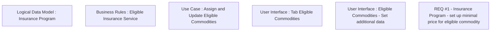

# CBL-8496 (CLM-2622) Setting up Minimal Goods Price for Insurance

```mermaid
graph TD
    Logical_Data_Model_Insurance_Program["Logical Data Model : Insurance Program"]
    Business_Rules_Eligible_Insurance_Service["Business Rules : Eligible Insurance Service"]
    Use_Case_Assign_Update_Eligible_Commodities["Use Case : Assign and Update Eligible Commodities"]
    User_Interface_Tab_Eligible_Commodities["User Interface : Tab Eligible Commodities"]
    User_Interface_Eligible_Commodities_Set_additional_data["User Interface : Eligible Commodities - Set additional data"]
    REQ_1_Insurance_Program_set_up_minimal_price_for_eligible_co["REQ #1 - Insurance Program - set up minimal price for eligible commodity"]
```
