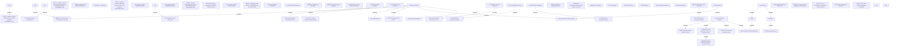

# CBL-8652 (CLM-2697) Enhancement API ContractDocument

```mermaid
graph TD
    el_1880224["Note"]
    el_1880242["Note"]
    el_1869819["Note"]
    MOD_08_346_Add_Insurance_service_on_Contract_common["{MOD}08.346 Add Insurance service on Contract common"]
    n_08_454_Terminate_contract_insurance_service["08.454 Terminate contract insurance service"]
    n_08_452_Cancel_contract_insurance_service["08.452 Cancel contract insurance service"]
    MOD_08_347_Add_Insurance_service_on_Contract_service["{MOD}08.347 Add Insurance service on Contract service"]
    REQ_5_Update_Contract_Insurance_Services_WS_to_use_UUID_inst["REQ #5 - Update Contract Insurance Services WS to use UUID instead of DOCUMENT_REF"]
    MOD_01_280_Record_document_mistake_v2["{MOD}01.280 Record document mistake v2"]
    Documents_Documents["Documents : Documents"]
    REQ_4_Update_Document_REST_API_services_to_use_UUID_instead_["REQ #4 - Update Document REST API services to use UUID instead of DOCUMENT_REF"]
    User_Interface_Model_Upload_document["User Interface Model : Upload document"]
    el_1509516["Note"]
    User_Interface_Model_Add_Edit_document["User Interface Model : Add/Edit document"]
    REQ_3_Update_Contract_Detail_GUI_to_use_UUID_instead_of_DOCU["REQ #3 - Update Contract Detail GUI to use UUID instead of DOCUMENT_REF"]
    REQ_2_Update_ContractDocument_WS_to_use_UUID_instead_of_DOCU["REQ #2 - Update ContractDocument WS to use UUID instead of DOCUMENT_REF"]
    ContractDocuments_ContractDocumentWS_Create_document["ContractDocuments : ContractDocumentWS - Create document"]
    User_Interface_Model_Contract_detail["User Interface Model : Contract detail"]
    REQ_1_Extend_the_table_HO_BSL_DOCUMENT_with_the_column_UUID["REQ #1 - Extend the table HO.BSL_DOCUMENT with the column UUID"]
    Logical_Data_Model_Document["Logical Data Model : Document "]
    n_01_792_Set_Document_ProofCheck_service["01.792 Set Document ProofCheck service"]
    n_01_791_Set_Document_File_service["01.791 Set Document File service"]
    n_01_790_Get_Contract_Documents_detail_service["01.790 Get Contract Documents detail service"]
    MOD_01_763_Get_Contract_Documents_for_self_care["{MOD}01.763 Get Contract Documents for self-care"]
    n_01_112_Edit_DDM_document["01.112 Edit DDM document"]
    MOD_01_113_Edit_client_document["{MOD}01.113 Edit client document"]
    MOD_01_110_Edit_contract_document["{MOD}01.110 Edit contract document"]
    n_08_356_Generate_service_request_document["08.356 Generate service request document"]
    n_01_126_Upload_client_document_file["01.126 Upload client document file"]
    n_01_125_Upload_contract_document["01.125 Upload contract document"]
    n_01_122_Delete_DDM_document["01.122 Delete DDM document"]
    n_01_123_Delete_client_document["01.123 Delete client document"]
    n_01_120_Delete_contract_document["01.120 Delete contract document"]
    n_01_006_Delete_file_from_document_archive["01.006 Delete file from document archive"]
    n_01_102_Add_DDM_document["01.102 Add DDM document"]
    n_01_103_Add_client_document["01.103 Add client document"]
    MOD_01_100_Add_contract_document["{MOD}01.100 Add contract document"]
    n_01_009_Upload_file_to_document_archive["01.009 Upload file to document archive"]
    n_01_108_Add_DDM_document_common["01.108 Add DDM document common"]
    n_01_106_Add_client_document_common["01.106 Add client document common"]
    n_01_107_Add_contract_document_common["01.107 Add contract document common"]
    Common_for_ContractDocument_WS_and_Contract_detail_GUI["Common for ContractDocument WS and Contract detail GUI"]
    Supplement_documents["Supplement documents"]
    Client_documents["Client documents"]
    Contract_documents["Contract documents"]
    DDM_documents["DDM documents"]
    Service_request_documents["Service request documents"]
    Document_mistakes["Document mistakes"]
    DocumentData["DocumentData"]
    SetDocumentProofCheckResponse["SetDocumentProofCheckResponse"]
    ContractDocuments["ContractDocuments"]
    SetDocumentFileResponse["SetDocumentFileResponse"]
    LoanService["LoanService"]
    Document_Services["Document Services"]
    GetContractListInsurancesResponse["GetContractListInsurancesResponse"]
    Contract_Insurance_Services["Contract Insurance Services"]
    Contract["Contract"]
    GetDocumentsResponse["GetDocumentsResponse"]
    Document["Document"]
    n_13_220_Upload_supplement_document["13.220 Upload supplement document"]
    DEL_01_277_Set_document_registration_check_service["{DEL}01.277 Set document registration check service"]
    DEL_01_276_Get_documents_for_registration_checking_service["{DEL}01.276 Get documents for registration checking service"]
    n_13_210_Delete_supplement_document["13.210 Delete supplement document"]
    DEL_13_205_Create_contract_supplement_documents["{DEL}13.205 Create contract supplement documents"]
    el_1879358["Note"]
    el_1879356["Note"]
    el_1509516 -->|unnamed| REQ_3_Update_Contract_Detail_GUI_to_use_UUID_instead_of_DOCU
    MOD_08_347_Add_Insurance_service_on_Contract_service -->|unnamed| MOD_08_346_Add_Insurance_service_on_Contract_common
    n_01_102_Add_DDM_document -->|unnamed| n_01_108_Add_DDM_document_common
    n_01_103_Add_client_document -->|unnamed| n_01_106_Add_client_document_common
    MOD_01_100_Add_contract_document -->|unnamed| n_01_107_Add_contract_document_common
    n_01_120_Delete_contract_document -->|unnamed| n_01_006_Delete_file_from_document_archive
    DocumentData -->|unnamed| SetDocumentProofCheckResponse
    Document_Services -->|unnamed| n_01_792_Set_Document_ProofCheck_service
    Document_Services -->|unnamed| MOD_01_763_Get_Contract_Documents_for_self_care
    Document_Services -->|unnamed| n_01_790_Get_Contract_Documents_detail_service
    Document_Services -->|unnamed| ContractDocuments
    Document_Services -->|unnamed| n_01_791_Set_Document_File_service
    LoanService -->|unnamed| Contract
    Document_Services -->|unnamed| SetDocumentProofCheckResponse
    Document_Services -->|unnamed| SetDocumentFileResponse
    Document -->|unnamed| GetDocumentsResponse
    LoanService -->|unnamed| Document
    Contract_Insurance_Services -->|unnamed| n_08_454_Terminate_contract_insurance_service
    Contract_Insurance_Services -->|unnamed| MOD_08_347_Add_Insurance_service_on_Contract_service
    Contract_Insurance_Services -->|unnamed| n_08_452_Cancel_contract_insurance_service
    Contract_Insurance_Services -->|unnamed| GetContractListInsurancesResponse
    Contract -->|unnamed| GetContractListInsurancesResponse
    el_1869819 -->|unnamed| MOD_01_763_Get_Contract_Documents_for_self_care
    el_1880242 -->|unnamed| n_01_126_Upload_client_document_file
    el_1880224 -->|unnamed| n_01_125_Upload_contract_document
```
