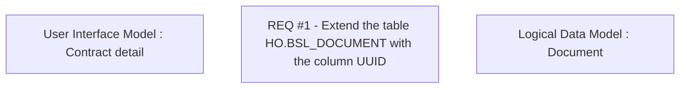

# REQ #1 - Extened the table HO.BSL_DOCUMENT with the column UUID

- **Diagram Type**: Custom
- **Package**: HomerSelect/BSL/Requirements Model/Finished/CLM/CBL-8652 (CLM-2697) Enhancement API ContractDocument
- **Diagram ID**: 126632
- **Elements**: 3
- **Connectors**: 0

