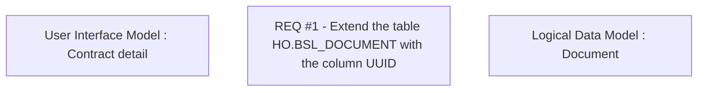

# REQ #1 - Extened the table HO.BSL_DOCUMENT with the column UUID

```mermaid
graph TD
    User_Interface_Model_Contract_detail["User Interface Model : Contract detail"]
    REQ_1_Extend_the_table_HO_BSL_DOCUMENT_with_the_column_UUID["REQ #1 - Extend the table HO.BSL_DOCUMENT with the column UUID"]
    Logical_Data_Model_Document["Logical Data Model : Document "]
```
