# REQ #3 - Update Contract Detail GUI to use UUID instead of DOCUMENT_REF

- **Diagram Type**: Custom
- **Package**: HomerSelect/BSL/Requirements Model/Finished/CLM/CBL-8652 (CLM-2697) Enhancement API ContractDocument
- **Diagram ID**: 126633
- **Elements**: 36
- **Connectors**: 7

```mermaid
graph TD
    el_1879356["Note"]
    DEL_13_205_Create_contract_supplement_documents["{DEL}13.205 Create contract supplement documents"]
    n_13_210_Delete_supplement_document["13.210 Delete supplement document"]
    n_13_220_Upload_supplement_document["13.220 Upload supplement document"]
    el_1879358["Note"]
    el_1880224["Note"]
    el_1880242["Note"]
    MOD_01_280_Record_document_mistake_v2["{MOD}01.280 Record document mistake v2"]
    User_Interface_Model_Upload_document["User Interface Model : Upload document"]
    n_01_112_Edit_DDM_document["01.112 Edit DDM document"]
    MOD_01_113_Edit_client_document["{MOD}01.113 Edit client document"]
    MOD_01_110_Edit_contract_document["{MOD}01.110 Edit contract document"]
    n_08_356_Generate_service_request_document["08.356 Generate service request document"]
    n_01_126_Upload_client_document_file["01.126 Upload client document file"]
    n_01_125_Upload_contract_document["01.125 Upload contract document"]
    n_01_122_Delete_DDM_document["01.122 Delete DDM document"]
    n_01_123_Delete_client_document["01.123 Delete client document"]
    n_01_120_Delete_contract_document["01.120 Delete contract document"]
    n_01_006_Delete_file_from_document_archive["01.006 Delete file from document archive"]
    n_01_102_Add_DDM_document["01.102 Add DDM document"]
    n_01_103_Add_client_document["01.103 Add client document"]
    MOD_01_100_Add_contract_document["{MOD}01.100 Add contract document"]
    n_01_009_Upload_file_to_document_archive["01.009 Upload file to document archive"]
    n_01_108_Add_DDM_document_common["01.108 Add DDM document common"]
    n_01_106_Add_client_document_common["01.106 Add client document common"]
    n_01_107_Add_contract_document_common["01.107 Add contract document common"]
    el_1509516["Note"]
    User_Interface_Model_Add_Edit_document["User Interface Model : Add/Edit document"]
    REQ_3_Update_Contract_Detail_GUI_to_use_UUID_instead_of_DOCU["REQ #3 - Update Contract Detail GUI to use UUID instead of DOCUMENT_REF"]
    Service_request_documents["Service request documents"]
    DDM_documents["DDM documents"]
    Contract_documents["Contract documents"]
    Client_documents["Client documents"]
    Supplement_documents["Supplement documents"]
    Common_for_ContractDocument_WS_and_Contract_detail_GUI["Common for ContractDocument WS and Contract detail GUI"]
    Document_mistakes["Document mistakes"]
    el_1509516 -->|unnamed| REQ_3_Update_Contract_Detail_GUI_to_use_UUID_instead_of_DOCU
    n_01_102_Add_DDM_document -->|unnamed| n_01_108_Add_DDM_document_common
    n_01_103_Add_client_document -->|unnamed| n_01_106_Add_client_document_common
    MOD_01_100_Add_contract_document -->|unnamed| n_01_107_Add_contract_document_common
    n_01_120_Delete_contract_document -->|unnamed| n_01_006_Delete_file_from_document_archive
    el_1880224 -->|unnamed| n_01_125_Upload_contract_document
    el_1880242 -->|unnamed| n_01_126_Upload_client_document_file
```

