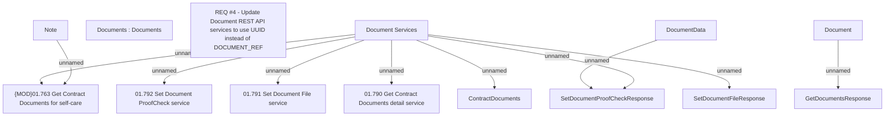

# REQ #4 - Update Document REST API services to use UUID instead of DOCUMENT_REF

```mermaid
graph TD
    el_1869819["Note"]
    Documents_Documents["Documents : Documents"]
    REQ_4_Update_Document_REST_API_services_to_use_UUID_instead_["REQ #4 - Update Document REST API services to use UUID instead of DOCUMENT_REF"]
    n_01_792_Set_Document_ProofCheck_service["01.792 Set Document ProofCheck service"]
    n_01_791_Set_Document_File_service["01.791 Set Document File service"]
    n_01_790_Get_Contract_Documents_detail_service["01.790 Get Contract Documents detail service"]
    MOD_01_763_Get_Contract_Documents_for_self_care["{MOD}01.763 Get Contract Documents for self-care"]
    Document_Services["Document Services"]
    SetDocumentProofCheckResponse["SetDocumentProofCheckResponse"]
    DocumentData["DocumentData"]
    SetDocumentFileResponse["SetDocumentFileResponse"]
    ContractDocuments["ContractDocuments"]
    Document["Document"]
    GetDocumentsResponse["GetDocumentsResponse"]
    Document_Services -->|unnamed| n_01_792_Set_Document_ProofCheck_service
    Document_Services -->|unnamed| n_01_791_Set_Document_File_service
    Document_Services -->|unnamed| n_01_790_Get_Contract_Documents_detail_service
    Document_Services -->|unnamed| MOD_01_763_Get_Contract_Documents_for_self_care
    Document_Services -->|unnamed| ContractDocuments
    DocumentData -->|unnamed| SetDocumentProofCheckResponse
    Document_Services -->|unnamed| SetDocumentProofCheckResponse
    Document_Services -->|unnamed| SetDocumentFileResponse
    Document -->|unnamed| GetDocumentsResponse
    el_1869819 -->|unnamed| MOD_01_763_Get_Contract_Documents_for_self_care
```
