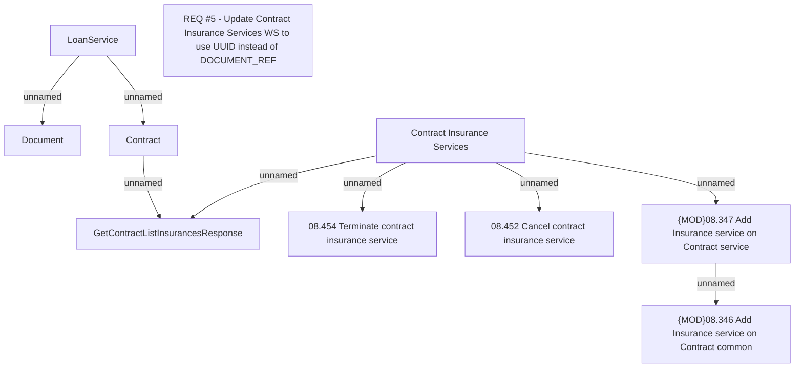

# REQ #5 - Update Contract Insurance Services WS to use UUID instead of DOCUMENT_REF

- **Diagram Type**: Custom
- **Package**: HomerSelect/BSL/Requirements Model/Finished/CLM/CBL-8652 (CLM-2697) Enhancement API ContractDocument
- **Diagram ID**: 126636
- **Elements**: 10
- **Connectors**: 8

