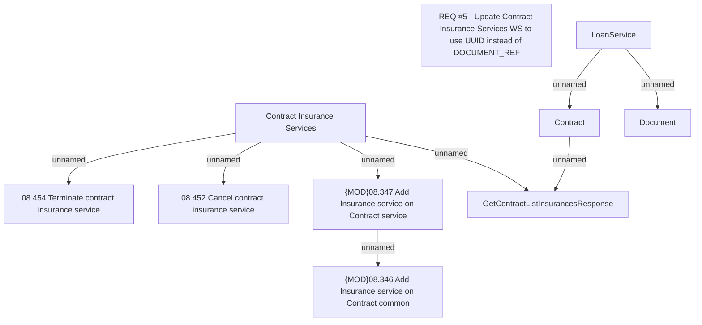

# REQ #5 - Update Contract Insurance Services WS to use UUID instead of DOCUMENT_REF

```mermaid
graph TD
    MOD_08_346_Add_Insurance_service_on_Contract_common["{MOD}08.346 Add Insurance service on Contract common"]
    n_08_454_Terminate_contract_insurance_service["08.454 Terminate contract insurance service"]
    n_08_452_Cancel_contract_insurance_service["08.452 Cancel contract insurance service"]
    MOD_08_347_Add_Insurance_service_on_Contract_service["{MOD}08.347 Add Insurance service on Contract service"]
    REQ_5_Update_Contract_Insurance_Services_WS_to_use_UUID_inst["REQ #5 - Update Contract Insurance Services WS to use UUID instead of DOCUMENT_REF"]
    LoanService["LoanService"]
    Contract["Contract"]
    Contract_Insurance_Services["Contract Insurance Services"]
    GetContractListInsurancesResponse["GetContractListInsurancesResponse"]
    Document["Document"]
    MOD_08_347_Add_Insurance_service_on_Contract_service -->|unnamed| MOD_08_346_Add_Insurance_service_on_Contract_common
    LoanService -->|unnamed| Contract
    LoanService -->|unnamed| Document
    Contract_Insurance_Services -->|unnamed| MOD_08_347_Add_Insurance_service_on_Contract_service
    Contract_Insurance_Services -->|unnamed| n_08_452_Cancel_contract_insurance_service
    Contract_Insurance_Services -->|unnamed| n_08_454_Terminate_contract_insurance_service
    Contract_Insurance_Services -->|unnamed| GetContractListInsurancesResponse
    Contract -->|unnamed| GetContractListInsurancesResponse
```
