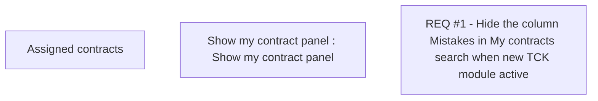

# CBL-8674 (CLM-2654) Hide the column Mistakes in My contracts search when new TCK module active

- **Diagram Type**: Custom
- **Package**: HomerSelect/BSL/Requirements Model/Finished/CLM/CBL-8674 (CLM-2654) Hide the column Mistakes in My contracts search when new TCK module active
- **Diagram ID**: 124043
- **Elements**: 3
- **Connectors**: 0

