# CBL-8720 (CLM-2719) Availability of DA document to Sales Agents & Retailer Agents

- **Diagram Type**: Custom
- **Package**: HomerSelect/BSL/Requirements Model/Finished/CLM/CBL-8720 (CLM-2719) Availability of DA document to Sales Agents & Retailer Agents
- **Diagram ID**: 126546
- **Elements**: 25
- **Connectors**: 15

```mermaid
graph TD
    MOD_Show_documents_based_on_security_level["{MOD}Show documents based on security level"]
    ADD_01_128_Preview_document_status_Signed["{ADD}01.128 Preview document (status Signed)"]
    ADD_01_128_Preview_document_status_Active["{ADD}01.128 Preview document (status Active)"]
    COMMON_for_documents_COMMON_for_documents["COMMON for documents : COMMON for documents"]
    REQ_3_Update_access_rights_and_document_types_configuration["REQ#3 - Update access rights and document types configuration"]
    MOD_01_210_Show_contract_detail["{MOD}01.210 Show contract detail"]
    Document_printouts_Document_printouts_Access_Rights["Document printouts : Document printouts - Access Rights"]
    Contract_documents_Contract_documents_Access_Rights["Contract documents : Contract documents - Access Rights"]
    Client_documents_Client_documents_Access_Rights["Client documents : Client documents - Access Rights"]
    ADD_01_128_Preview_contract_document_with_security_level_2_f["{ADD}01.128 Preview contract document with security level 2 (file download)"]
    ADD_01_128_Preview_document_printout_with_security_level_1_f["{ADD}01.128 Preview document printout with security level 1 (file download)"]
    ADD_01_128_Preview_document_printouts_file_download["{ADD}01.128 Preview document printouts (file download)"]
    ADD_01_128_Preview_client_document_with_security_level_2["{ADD}01.128 Preview client document with security level 2"]
    ADD_01_128_Preview_client_document_with_security_level_1["{ADD}01.128 Preview client document with security level 1"]
    ADD_01_128_Preview_client_document_with_security_level_2_fil["{ADD}01.128 Preview client document with security level 2 (file download)"]
    ADD_01_128_Preview_client_document_with_security_level_1_fil["{ADD}01.128 Preview client document with security level 1 (file download)"]
    ADD_01_128_Preview_document_printout_with_security_level_2_f["{ADD}01.128 Preview document printout with security level 2 (file download)"]
    ADD_01_128_Preview_contract_document_with_security_level_1_f["{ADD}01.128 Preview contract document with security level 1 (file download)"]
    MOD_Preview_documents_based_on_security_level["{MOD}Preview documents based on security level"]
    ADD_01_210_Show_contract_detail_document_with_security_level["{ADD}01.210 Show contract detail (document with security level 2)"]
    REQ_1_Add_support_for_show_security_level_2_documents["REQ #1 - Add support for show security level 2 documents"]
    BIZ_1_Restrict_document_files_download_on_document_level["BIZ#1 Restrict document files download on document level"]
    n_01_210_Show_contract_detail_document_with_security_level_1["01.210 Show contract detail (document with security level 1)"]
    REQ_2_Implement_document_download_based_on_security_level["REQ#2 - Implement document download based on security level"]
    MOD_01_128_Preview_document["{MOD}01.128 Preview document"]
    MOD_01_210_Show_contract_detail -->|unnamed| n_01_210_Show_contract_detail_document_with_security_level_1
    MOD_01_210_Show_contract_detail -->|unnamed| ADD_01_210_Show_contract_detail_document_with_security_level
    MOD_01_210_Show_contract_detail -->|unnamed| MOD_Show_documents_based_on_security_level
    MOD_01_128_Preview_document -->|unnamed| MOD_Preview_documents_based_on_security_level
    MOD_01_128_Preview_document -->|unnamed| ADD_01_128_Preview_contract_document_with_security_level_1_f
    MOD_01_128_Preview_document -->|unnamed| ADD_01_128_Preview_document_printout_with_security_level_1_f
    MOD_01_128_Preview_document -->|unnamed| ADD_01_128_Preview_client_document_with_security_level_1_fil
    MOD_01_128_Preview_document -->|unnamed| ADD_01_128_Preview_client_document_with_security_level_1
    MOD_01_128_Preview_document -->|unnamed| ADD_01_128_Preview_client_document_with_security_level_2
    MOD_01_128_Preview_document -->|unnamed| ADD_01_128_Preview_document_status_Active
    MOD_01_128_Preview_document -->|unnamed| ADD_01_128_Preview_document_printout_with_security_level_2_f
    MOD_01_128_Preview_document -->|unnamed| ADD_01_128_Preview_contract_document_with_security_level_2_f
    MOD_01_128_Preview_document -->|unnamed| ADD_01_128_Preview_document_status_Signed
    MOD_01_128_Preview_document -->|unnamed| ADD_01_128_Preview_client_document_with_security_level_2_fil
    MOD_01_128_Preview_document -->|unnamed| ADD_01_128_Preview_document_printouts_file_download
```

