# CBL-8744 (CLM-2708) Show Communication List in BSL UI for CUID without any contract

- **Diagram Type**: Custom
- **Package**: HomerSelect/BSL/Requirements Model/Finished/CLM/CBL-8744 (CLM-2708) Show Communication List in BSL UI for CUID without any contract
- **Diagram ID**: 125432
- **Elements**: 9
- **Connectors**: 0

```mermaid
graph TD
    CLM_Feature_Flags_CLM_Feature_Flags["CLM Feature Flags : CLM Feature Flags"]
    n_07_041_Create_communication_record["07.041 Create communication record"]
    Use_Case_Communication_records["Use Case : Communication records"]
    MOD_07_040_Create_communication_record_manually["{MOD}07.040 Create communication record manually"]
    Logical_Data_Model_Communication["Logical Data Model : Communication"]
    MOD_07_020_Show_list_of_communication["{MOD}07.020 Show list of communication"]
    Client_detail_Client_detail["Client detail : Client detail"]
    REQ_1_Update_of_List_of_communication_and_Create_communicati["REQ#1 - Update of List of communication and Create communication functionality on Client detail screen to support usage also for CUID withous any contract."]
    Tab_List_of_communication["Tab List of communication"]
```

