# CBL-8752 (CLM-2700) Separate document management and expose it via REST API

- **Diagram Type**: Custom
- **Package**: HomerSelect/BSL/Requirements Model/Finished/CLM/CBL-8752 (CLM-2700) Separate document management and expose it via REST API
- **Diagram ID**: 125864
- **Elements**: 45
- **Connectors**: 30

```mermaid
graph TD
    ClientDocument["ClientDocument"]
    Contract_Supplement_Document["Contract Supplement Document"]
    Client_Supplement_Document["Client Supplement Document"]
    Ticket["Ticket"]
    MistakeSetting["MistakeSetting"]
    TempAppl_Document_Attribute["TempAppl Document Attribute"]
    Custom_Data_Definition["Custom Data Definition"]
    MOD_Checking_Terms_of_Loan["{MOD}Checking Terms of Loan"]
    DEL_TickedClientDocumentType["{DEL}TickedClientDocumentType"]
    TempAppl_Document["TempAppl Document"]
    Supplement_Document_Type["Supplement Document Type"]
    Service_To_Document_Type["Service To Document Type"]
    Salesroom_Document_Type["Salesroom Document Type"]
    Product_Profile_Document_Rule["Product Profile Document Rule"]
    Product_Offer_Request_Document_Type["Product Offer Request Document Type"]
    Product_Document_Printout["Product Document Printout"]
    Person_Document_Type["Person Document Type"]
    Document_Type_Validation["Document Type Validation"]
    Document_Type_To_Container["Document Type To Container"]
    Document_type["Document type"]
    Document_type["Document type"]
    Document_type["Document type"]
    Document_Processing_Configuration["Document Processing Configuration"]
    Document_Container_to_Document_Type["Document Container to Document Type"]
    DEL_ClientDocumentType["{DEL}ClientDocumentType"]
    Checked_document_type["Checked document  type"]
    Document_Type["Document Type"]
    Document_Type_Attribute["Document Type Attribute"]
    User["User"]
    Agreement["Agreement"]
    DMS_File["DMS File"]
    Document_Attribute["Document Attribute"]
    Person_Document["Person Document"]
    Installment_Version_Printout["Installment Version Printout"]
    Document["Document"]
    Document_Verification["Document Verification"]
    Loan_Service_Request_Document["Loan Service Request Document"]
    Contract_Document["Contract Document"]
    MOD_DDM_Document["{MOD}DDM Document"]
    Client_Document["Client Document"]
    CLM_2700_Separate_document_management_and_expose_it_via_REST["CLM-2700 Separate document management and expose it via REST API"]
    LOR["LOR"]
    ISPAY["ISPAY"]
    CLM["CLM"]
    PCG["PCG"]
    Document_type -->|unnamed| Document_Type
    Document_type -->|unnamed| Document_Type
    MOD_Checking_Terms_of_Loan -->|unnamed| Document_Type
    Checked_document_type -->|unnamed| Document_Type
    Document_Container_to_Document_Type -->|unnamed| Document_Type
    Product_Profile_Document_Rule -->|unnamed| Document_Type
    Document_type -->|unnamed| Document_Type
    Document_Attribute -->|unnamed| Document
    TempAppl_Document_Attribute -->|unnamed| Document_Type_Attribute
    TempAppl_Document_Attribute -->|unnamed| TempAppl_Document
    TempAppl_Document -->|unnamed| Document_Type
    Agreement -->|has| DMS_File
    Contract_Document -->|unnamed| Document
    Product_Offer_Request_Document_Type -->|unnamed| Document_Type
    Loan_Service_Request_Document -->|unnamed| Document
    Product_Document_Printout -->|unnamed| Document_Type
    DMS_File -->|unnamed| User
    Document_Type_To_Container -->|unnamed| Document_Type
    Document_Processing_Configuration -->|unnamed| Document_Type
    Document_Type_Validation -->|unnamed| Document_Type
    Document_Type_Attribute -->|unnamed| Document_Type
    Document_Type_Attribute -->|unnamed| Custom_Data_Definition
    Installment_Version_Printout -->|unnamed| Document
    Salesroom_Document_Type -->|required for picture taking| Document_Type
    Client_Document -->|unnamed| Document
    Service_To_Document_Type -->|unnamed| Document_Type
    DEL_ClientDocumentType -->|unnamed| Document_Type
    DEL_TickedClientDocumentType -->|unnamed| Document_Type
    Person_Document -->|unnamed| Document
    MOD_DDM_Document -->|unnamed| Document
```

