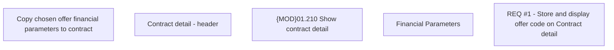

# CBL-8758 (CLM-2846) Display offer type code on Contract Detail

- **Diagram Type**: Custom
- **Package**: HomerSelect/BSL/Requirements Model/Finished/CLM/CBL-8758 (CLM-2846) Display offer type code on Contract Detail
- **Diagram ID**: 144775
- **Elements**: 5
- **Connectors**: 0

