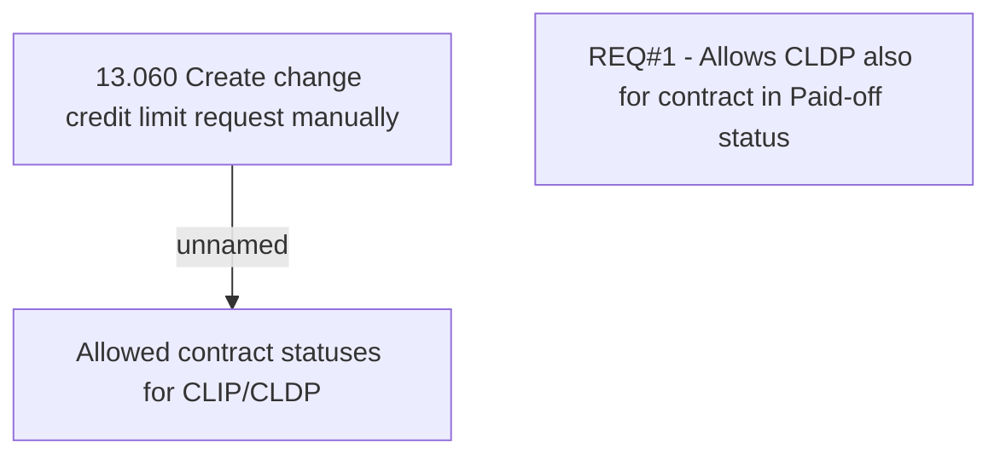

# CBL-8776 (CLM-2825) Decrease credit limit for paid-off contracts

```mermaid
graph TD
    Allowed_contract_statuses_for_CLIP_CLDP["Allowed contract statuses for CLIP/CLDP"]
    n_13_060_Create_change_credit_limit_request_manually["13.060 Create change credit limit request manually"]
    REQ_1_Allows_CLDP_also_for_contract_in_Paid_off_status["REQ#1 - Allows CLDP also for contract in Paid-off status"]
    n_13_060_Create_change_credit_limit_request_manually -->|unnamed| Allowed_contract_statuses_for_CLIP_CLDP
```
