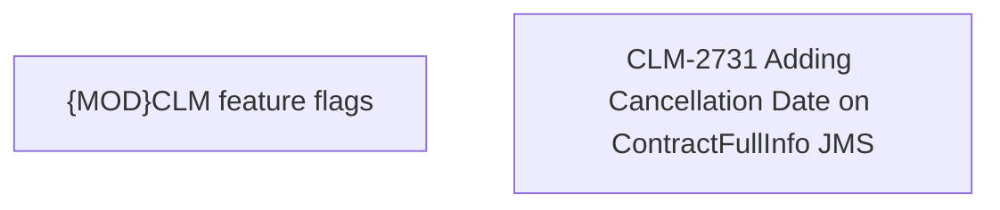

# CBL-8838 (CLM-2731) Adding Cancellation Date on ContractFullInfo JMS

- **Diagram Type**: Custom
- **Package**: HomerSelect/BSL/Requirements Model/Finished/CLM/CBL-8838 (CLM-2731) Adding Cancellation Date on ContractFullInfo JMS
- **Diagram ID**: 125041
- **Elements**: 2
- **Connectors**: 0

