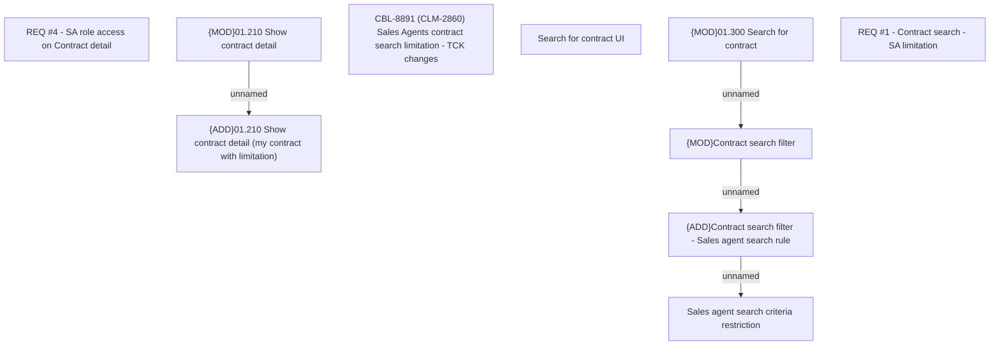

# CBL-8891 (CLM-2860) Sales Agents contract search limitation

```mermaid
graph TD
    REQ_4_SA_role_access_on_Contract_detail["REQ #4 - SA role access on Contract detail"]
    ADD_01_210_Show_contract_detail_my_contract_with_limitation["{ADD}01.210 Show contract detail (my contract with limitation)"]
    MOD_01_210_Show_contract_detail["{MOD}01.210 Show contract detail"]
    CBL_8891_CLM_2860_Sales_Agents_contract_search_limitation_TC["CBL-8891 (CLM-2860) Sales Agents contract search limitation - TCK changes"]
    ADD_Contract_search_filter_Sales_agent_search_rule["{ADD}Contract search filter - Sales agent search rule"]
    Sales_agent_search_criteria_restriction["Sales agent search criteria restriction"]
    Search_for_contract_UI["Search for contract UI"]
    MOD_Contract_search_filter["{MOD}Contract search filter"]
    MOD_01_300_Search_for_contract["{MOD}01.300 Search for contract"]
    REQ_1_Contract_search_SA_limitation["REQ #1 - Contract search - SA limitation"]
    MOD_Contract_search_filter -->|unnamed| ADD_Contract_search_filter_Sales_agent_search_rule
    ADD_Contract_search_filter_Sales_agent_search_rule -->|unnamed| Sales_agent_search_criteria_restriction
    MOD_01_210_Show_contract_detail -->|unnamed| ADD_01_210_Show_contract_detail_my_contract_with_limitation
    MOD_01_300_Search_for_contract -->|unnamed| MOD_Contract_search_filter
```
