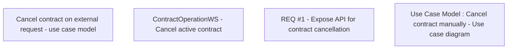

# CBL-8973 (CLM-2790) New API to Cancel the Active Contract

- **Diagram Type**: Custom
- **Package**: HomerSelect/BSL/Requirements Model/Finished/CLM/CBL-8973 (CLM-2790) New API to Cancel the Active Contract
- **Diagram ID**: 144777
- **Elements**: 4
- **Connectors**: 0

