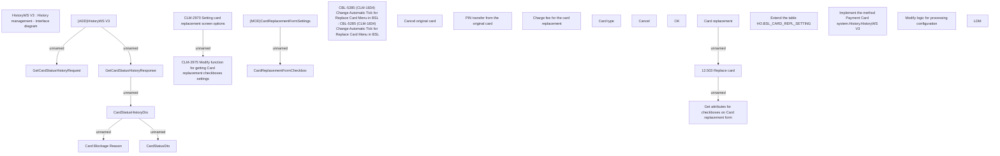

# CBL-8991 (CLM-2970) Setting card replacement screen options

```mermaid
graph TD
    HistoryWS_V3_History_management_Interface_diagram["HistoryWS V3 : History management - Interface diagram"]
    Card_Blockage_Reason["Card Blockage Reason"]
    CardStatusHistoryDto["CardStatusHistoryDto"]
    CardStatusDto["CardStatusDto"]
    GetCardStatusHistoryRequest["GetCardStatusHistoryRequest"]
    GetCardStatusHistoryResponse["GetCardStatusHistoryResponse"]
    ADD_HistoryWS_V3["{ADD}HistoryWS V3"]
    CLM_2975_Modify_function_for_getting_Card_replacement_checkb["CLM-2975 Modify function for getting Card replacement checkboxes settings"]
    CardReplacementFormCheckbox["CardReplacementFormCheckbox"]
    MOD_CardReplacementFormSettings["{MOD}CardReplacementFormSettings"]
    CLM_2970_Setting_card_replacement_screen_options["CLM-2970 Setting card replacement screen options"]
    CBL_5285_CLM_1834_Change_Automatic_Tick_for_Replace_Card_Men["CBL-5285 (CLM-1834) Change Automatic Tick for Replace Card Menu in BSL : CBL-5285 (CLM-1834) Change Automatic Tick for Replace Card Menu in BSL"]
    Cancel_original_card["Cancel original card"]
    PIN_transfer_from_the_original_card["PIN transfer from the original card"]
    Charge_fee_for_the_card_replacement["Charge fee for the card replacement"]
    Card_type["Card type"]
    Cancel["Cancel"]
    OK["OK"]
    Card_replacement["Card replacement"]
    n_12_503_Replace_card["12.503 Replace card"]
    Get_attributes_for_checkboxes_on_Card_replacement_form["Get attributes for checkboxes on Card replacement form"]
    Extend_the_table_HO_BSL_CARD_REPL_SETTING["Extend the table HO.BSL_CARD_REPL_SETTING"]
    Implement_the_method_Payment_Card_system_History_HistoryWS_V["Implement the method Payment Card system.History.HistoryWS V3"]
    Modify_logic_for_processing_configuration["Modify logic for processing configuration"]
    LDM["LDM"]
    CardStatusDto["CardStatusDto"]
    CLM_2970_Setting_card_replacement_screen_options -->|unnamed| CLM_2975_Modify_function_for_getting_Card_replacement_checkb
    CardStatusHistoryDto -->|unnamed| Card_Blockage_Reason
    GetCardStatusHistoryResponse -->|unnamed| CardStatusHistoryDto
    CardStatusHistoryDto -->|unnamed| CardStatusDto
    ADD_HistoryWS_V3 -->|unnamed| GetCardStatusHistoryRequest
    ADD_HistoryWS_V3 -->|unnamed| GetCardStatusHistoryResponse
    MOD_CardReplacementFormSettings -->|unnamed| CardReplacementFormCheckbox
    n_12_503_Replace_card -->|unnamed| Get_attributes_for_checkboxes_on_Card_replacement_form
    Card_replacement -->|unnamed| n_12_503_Replace_card
```
