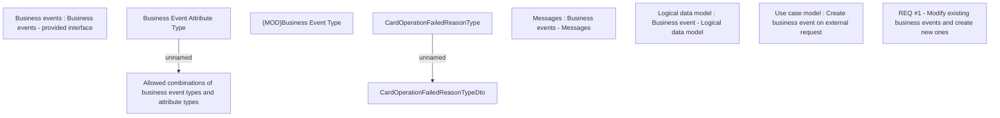

# CBL-9080 (CLM-2847) [VN NASA] Modification of BusinessEvents from CMSG

- **Diagram Type**: Custom
- **Package**: HomerSelect/BSL/Requirements Model/Finished/CLM/CBL-9080 (CLM-2847) [VN NASA] Modification of BusinessEvents from CMSG
- **Diagram ID**: 144813
- **Elements**: 10
- **Connectors**: 2

