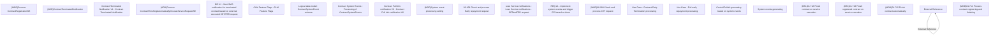

# CBL-9102 (CLM-2824) SMS/PUSH notification when CET/FER requested via Terminals

```mermaid
graph TD
    MOD_Process_ContractRegistrationSE["{MOD}Process ContractRegistrationSE"]
    ADD_ContractTerminatedNotification["{ADD}ContractTerminatedNotification"]
    Contract_Terminated_Notification_V1_Contract_Terminated_Noti["Contract Terminated Notification V1 : Contract Terminated Notification"]
    ADD_Process_ContractFinishingAutomaticallyOnLoanServiceReque["{ADD}Process ContractFinishingAutomaticallyOnLoanServiceRequestSE"]
    BIZ_1_Sent_SMS_notification_for_terminated_contract_based_on["BIZ #1 - Sent SMS notification for terminated contract based on external executed CET/FER request"]
    CLM_Feature_Flags_CLM_Feature_Flags["CLM Feature Flags : CLM Feature Flags"]
    Logical_data_model_ContractSystemEvent_schema["Logical data model : ContractSystemEvent schema"]
    Contract_System_Events_Processing_of_ContractSystemEvents["Contract System Events : Processing of ContractSystemEvents"]
    Contract_Full_Info_notification_V6_Contract_Full_Info_notifi["Contract Full Info notification V6 : Contract Full Info notification V6"]
    MOD_System_event_processing_setting["{MOD}System event processing setting"]
    n_03_100_Check_and_process_Early_repayment_request["03.100 Check and process Early repayment request"]
    Loan_Service_notifications_Loan_Service_notifications_CET_FE["Loan Service notifications : Loan Service notifications - CETandFER request"]
    REQ_1_Implement_system_events_and_trigger_CFI_based_on_them["REQ #1 - Implement system events and trigger CFI based on them"]
    MOD_08_280_Check_and_process_CET_request["{MOD}08.280 Check and process CET request"]
    Use_Case_Contract_Early_Termination_processing["Use Case : Contract Early Termination processing"]
    Use_Case_Contract_Early_Termination_processing["Use Case : Contract Early Termination processing"]
    Use_Case_Full_early_repayment_processing["Use Case : Full early repayment processing"]
    ControllFulInfo_generating_based_on_system_events["ControllFulInfo generating based on system events"]
    System_events_generating["System events generating"]
    DEL_01_712_Finish_contract_on_service_execution["{DEL}01.712 Finish contract on service execution"]
    DEL_01_713_Finish_registered_contract_on_service_execution["{DEL}01.713 Finish registered contract on service execution"]
    MOD_01_715_Finish_contract_automatically["{MOD}01.715 Finish contract automatically"]
    External_Reference["External Reference"]
    MOD_01_714_Process_contract_registering_and_finishing["{MOD}01.714 Process contract registering and finishing"]
    External_Reference["External Reference"]
    External_Reference -->|External Reference| External_Reference
```
