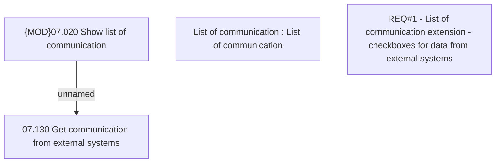

# CBL-9201 (CLM-2831) Adjust visibility of external data in Comm.list

```mermaid
graph TD
    n_07_130_Get_communication_from_external_systems["07.130 Get communication from external systems"]
    MOD_07_020_Show_list_of_communication["{MOD}07.020 Show list of communication"]
    List_of_communication_List_of_communication["List of communication : List of communication"]
    REQ_1_List_of_communication_extension_checkboxes_for_data_fr["REQ#1 - List of communication extension - checkboxes for data from external systems"]
    MOD_07_020_Show_list_of_communication -->|unnamed| n_07_130_Get_communication_from_external_systems
```
