# CBL-9226 (CLM-3768) Remove CLM dependencies on Commodity Module

- **Diagram Type**: Custom
- **Package**: HomerSelect/BSL/Requirements Model/Finished/CLM/CBL-9226 (CLM-3768) Remove CLM dependencies on Commodity Module
- **Diagram ID**: 144845
- **Elements**: 27
- **Connectors**: 13

```mermaid
graph TD
    External_Reference["External Reference"]
    MOD_ContractCommodity["{MOD}ContractCommodity"]
    Validate_IMEI_internally["Validate IMEI internally"]
    Get_application_commodity_data_for_update["Get application commodity data for update"]
    Get_application_commodity_type_data["Get application commodity type data"]
    Update_application_commodity["Update application commodity"]
    Access_Rights_Access_Rights["Access Rights : Access Rights"]
    Tab_Commodity_Tab_Commodity["Tab-Commodity : Tab-Commodity"]
    UseCase_Model_Manage_contract_commodities["UseCase Model : Manage contract commodities"]
    User_Interface_Model_Edit_commodity["User Interface Model : Edit commodity"]
    ADD_Get_contract_commodity_type_data["{ADD}Get contract commodity type data"]
    Unique_chassis_and_engine_numbers["Unique chassis and engine numbers"]
    Get_update_mode_for_commodity_data_update["Get update mode for commodity data update"]
    ADD_Update_contract_commodity["{ADD}Update contract commodity"]
    ADD_Get_contract_commodity_data_for_update["{ADD}Get contract commodity data for update"]
    ADD_01_650_Edit_Contract_Commodity_CLM["{ADD}01.650 Edit Contract Commodity [CLM]"]
    Commodity_Commodity["Commodity : Commodity"]
    External_Reference["External Reference"]
    Getting_Commodity_data_rule["Getting Commodity data rule"]
    CLM_3768_Remove_CLM_dependencies_on_Commodity_Module["CLM-3768 Remove CLM dependencies on Commodity Module"]
    MOD_01_758_Get_contract_commodities_for_self_care["{MOD}01.758 Get contract commodities for self-care"]
    n_01_650_Edit_Contract_Commodity["01.650 Edit Contract Commodity"]
    MOD_Validate_contract_commodity["{MOD}Validate contract commodity"]
    CFI["CFI"]
    Get_contract_commodities["Get contract commodities"]
    Commodity_validation["Commodity validation"]
    Edit_commodity_separation_from_shared_UC["Edit commodity + separation from shared UC"]
    n_01_650_Edit_Contract_Commodity -->|unnamed| Update_application_commodity
    n_01_650_Edit_Contract_Commodity -->|unnamed| Validate_IMEI_internally
    n_01_650_Edit_Contract_Commodity -->|unnamed| Get_update_mode_for_commodity_data_update
    n_01_650_Edit_Contract_Commodity -->|unnamed| Unique_chassis_and_engine_numbers
    n_01_650_Edit_Contract_Commodity -->|unnamed| Get_application_commodity_data_for_update
    ADD_01_650_Edit_Contract_Commodity_CLM -->|unnamed| ADD_Update_contract_commodity
    ADD_01_650_Edit_Contract_Commodity_CLM -->|unnamed| Validate_IMEI_internally
    ADD_01_650_Edit_Contract_Commodity_CLM -->|unnamed| Unique_chassis_and_engine_numbers
    ADD_01_650_Edit_Contract_Commodity_CLM -->|unnamed| ADD_Get_contract_commodity_data_for_update
    ADD_01_650_Edit_Contract_Commodity_CLM -->|unnamed| Get_update_mode_for_commodity_data_update
    MOD_01_758_Get_contract_commodities_for_self_care -->|unnamed| Getting_Commodity_data_rule
    MOD_Validate_contract_commodity -->|unnamed| Getting_Commodity_data_rule
    Unique_chassis_and_engine_numbers -->|unnamed| Getting_Commodity_data_rule
```

