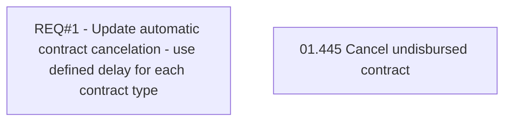

# CBL-9228 (CLM-2854) Remove Functionality of Cancelling Contract's with Outgoing Payment Status Not Delivered

- **Diagram Type**: Custom
- **Package**: HomerSelect/BSL/Requirements Model/Finished/CLM/CBL-9228 (CLM-2854) Remove Functionality of Cancelling Contract's with Outgoing Payment Status Not Delivered
- **Diagram ID**: 126483
- **Elements**: 2
- **Connectors**: 0

