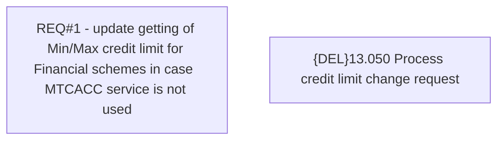

# CBL-9285 (CLM-2988) Credit limits for Fin.schemes without MTCACC

```mermaid
graph TD
    REQ_1_update_getting_of_Min_Max_credit_limit_for_Financial_s["REQ#1 - update getting of Min/Max credit limit for Financial schemes in case  MTCACC service is not used"]
    DEL_13_050_Process_credit_limit_change_request["{DEL}13.050 Process credit limit change request"]
```
