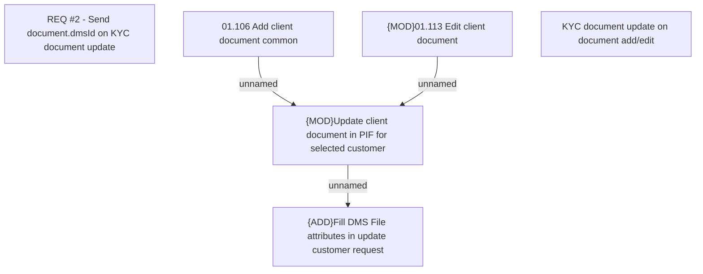

# REQ #2 - Send document.dmsId on KYC document update

```mermaid
graph TD
    ADD_Fill_DMS_File_attributes_in_update_customer_request["{ADD}Fill DMS File attributes in update customer request"]
    REQ_2_Send_document_dmsId_on_KYC_document_update["REQ #2 - Send document.dmsId on KYC document update"]
    MOD_01_113_Edit_client_document["{MOD}01.113 Edit client document"]
    n_01_106_Add_client_document_common["01.106 Add client document common"]
    MOD_Update_client_document_in_PIF_for_selected_customer["{MOD}Update client document in PIF for selected customer"]
    KYC_document_update_on_document_add_edit["KYC document update on document add/edit"]
    n_01_106_Add_client_document_common -->|unnamed| MOD_Update_client_document_in_PIF_for_selected_customer
    MOD_01_113_Edit_client_document -->|unnamed| MOD_Update_client_document_in_PIF_for_selected_customer
    MOD_Update_client_document_in_PIF_for_selected_customer -->|unnamed| ADD_Fill_DMS_File_attributes_in_update_customer_request
```
