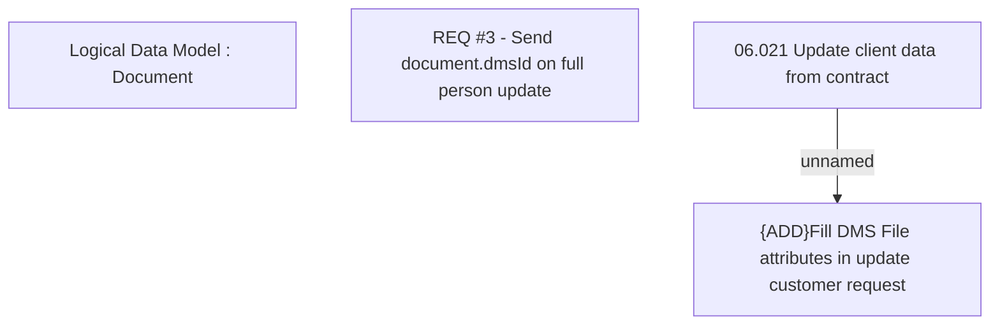

# REQ #3 - Send document.dmsId on full person update

- **Diagram Type**: Custom
- **Package**: HomerSelect/BSL/Requirements Model/Finished/CLM/CBL-9294 (CLM-3051) Process cabinet identifier in API request
- **Diagram ID**: 144833
- **Elements**: 4
- **Connectors**: 1

