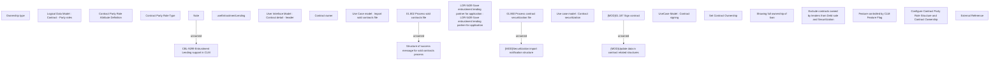

# CBL-9299 (CLM-2895) Entrustment Lending support in CLM

```mermaid
graph TD
    Ownership_type["Ownership type"]
    Logical_Data_Model_Contract_Party_roles["Logical Data Model : Contract - Party roles"]
    Contract_Party_Role_Attribute_Definition["Contract Party Role Attribute Definition"]
    Contract_Party_Role_Type["Contract Party Role Type"]
    el_1732561["Note"]
    useEntrustmentLending["useEntrustmentLending"]
    User_Interface_Model_Contract_detail_header["User Interface Model : Contract detail - header"]
    Contract_owner["Contract owner"]
    Use_Case_model_Import_sold_contracts_file["Use Case model : Import sold contracts file"]
    Structure_of_success_message_for_sold_contracts_process["Structure of success message for sold contracts process"]
    n_01_802_Process_sold_contracts_file["01.802 Process sold contracts file"]
    MOD_Securitization_import_notification_structure["{MOD}Securitization import notification structure"]
    LOR_5439_Save_entrustment_lending_partner_for_application_LO["LOR-5439 Save entrustment lending partner for application : LOR-5439 Save entrustment lending partner for application"]
    n_01_860_Process_contract_securitization_file["01.860 Process contract securitization file"]
    Use_case_model_Contract_securitization["Use case model : Contract securitization"]
    MOD_01_187_Sign_contract["{MOD}01.187 Sign contract"]
    MOD_Update_data_in_contract_related_structures["{MOD}Update data in contract related structures"]
    UseCase_Model_Contract_signing["UseCase Model : Contract signing"]
    CBL_9299_Entrustment_Lending_support_in_CLM["CBL-9299 Entrustment Lending support in CLM"]
    Set_Contract_Ownership["Set Contract Ownership"]
    Showing_full_ownership_of_loan["Showing full ownership of loan"]
    Exclude_contracts_owned_by_lenders_from_Debt_sale_and_Securi["Exclude contracts owned by lenders from Debt sale and Securitization"]
    Feature_controlled_by_CLM_Feature_Flag["Feature controlled by CLM Feature Flag"]
    Configure_Contract_Party_Role_Structure_and_Contract_Ownersh["Configure Contract Party Role Structure and Contract Ownership"]
    External_Reference["External Reference"]
    el_1732561 -->|unnamed| CBL_9299_Entrustment_Lending_support_in_CLM
    MOD_01_187_Sign_contract -->|unnamed| MOD_Update_data_in_contract_related_structures
    n_01_860_Process_contract_securitization_file -->|unnamed| MOD_Securitization_import_notification_structure
    n_01_802_Process_sold_contracts_file -->|unnamed| Structure_of_success_message_for_sold_contracts_process
```
