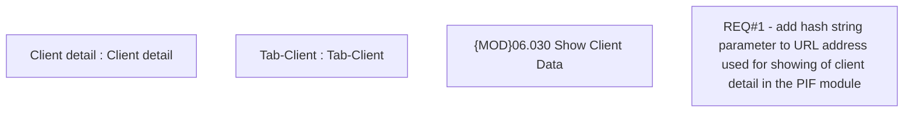

# CBL-9343 (CLM-3079) Add controls in client data access in PIF via URL

```mermaid
graph TD
    Client_detail_Client_detail["Client detail : Client detail"]
    Tab_Client_Tab_Client["Tab-Client : Tab-Client"]
    MOD_06_030_Show_Client_Data["{MOD}06.030 Show Client Data"]
    REQ_1_add_hash_string_parameter_to_URL_address_used_for_show["REQ#1 - add hash string parameter to URL address used for showing of client detail in the PIF module"]
```
