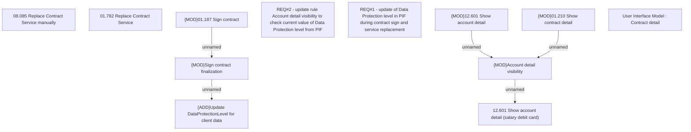

# CBL-9350 (CLM-2872) Salary project extension - employee flag update and usage

- **Diagram Type**: Custom
- **Package**: HomerSelect/BSL/Requirements Model/Finished/CLM/CBL-9350 (CLM-2872) Salary project extension - employee flag update and usage
- **Diagram ID**: 126474
- **Elements**: 12
- **Connectors**: 5

