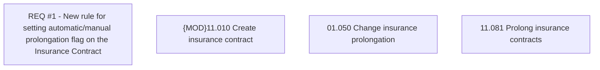

# CBL-9398 (CLM-2890) Automatic insurance prolongation optimisation

```mermaid
graph TD
    REQ_1_New_rule_for_setting_automatic_manual_prolongation_fla["REQ #1 - New rule for setting automatic/manual prolongation flag on the Insurance Contract"]
    MOD_11_010_Create_insurance_contract["{MOD}11.010 Create insurance contract"]
    n_01_050_Change_insurance_prolongation["01.050 Change insurance prolongation"]
    n_11_081_Prolong_insurance_contracts["11.081 Prolong insurance contracts"]
```
