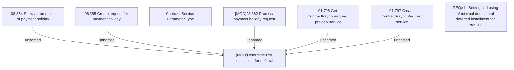

# CBL-9520 (CLM-2918) New requirements by Payment Holidays

- **Diagram Type**: Custom
- **Package**: HomerSelect/BSL/Requirements Model/Finished/CLM/CBL-9520 (CLM-2918) New requirements by Payment Holidays
- **Diagram ID**: 144776
- **Elements**: 8
- **Connectors**: 5

