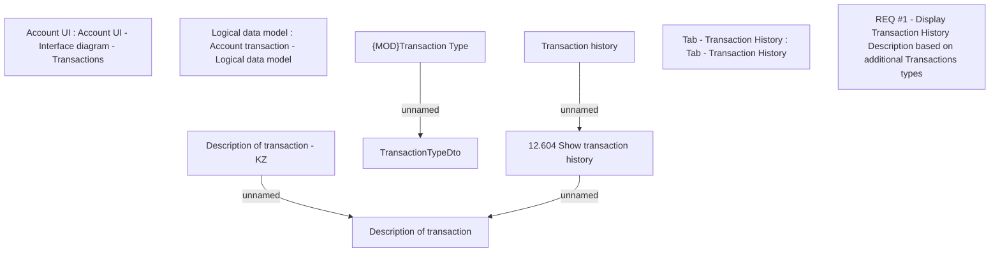

# CBL-9554 (CLM-3032) CREL Payhol - show new tariffs in transaction history

```mermaid
graph TD
    Account_UI_Account_UI_Interface_diagram_Transactions["Account UI : Account UI - Interface diagram - Transactions"]
    Description_of_transaction_KZ["Description of transaction - KZ"]
    Description_of_transaction["Description of transaction"]
    Logical_data_model_Account_transaction_Logical_data_model["Logical data model : Account transaction - Logical data model"]
    TransactionTypeDto["TransactionTypeDto"]
    MOD_Transaction_Type["{MOD}Transaction Type"]
    n_12_604_Show_transaction_history["12.604 Show transaction history"]
    Transaction_history["Transaction history"]
    Tab_Transaction_History_Tab_Transaction_History["Tab - Transaction History : Tab - Transaction History"]
    REQ_1_Display_Transaction_History_Description_based_on_addit["REQ #1 - Display Transaction History Description based on additional Transactions types"]
    Description_of_transaction_KZ -->|unnamed| Description_of_transaction
    Transaction_history -->|unnamed| n_12_604_Show_transaction_history
    MOD_Transaction_Type -->|unnamed| TransactionTypeDto
    n_12_604_Show_transaction_history -->|unnamed| Description_of_transaction
```
