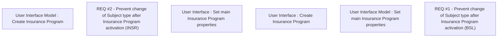

# CBL-9563 (CLM-2927) Insurance program - Subject type validation

```mermaid
graph TD
    User_Interface_Model_Create_Insurance_Program["User Interface Model : Create Insurance Program"]
    REQ_2_Prevent_change_of_Subject_type_after_Insurance_Program["REQ #2 - Prevent change of Subject type after Insurance Program activation (INSR)"]
    User_Interface_Set_main_Insurance_Program_properties["User Interface : Set main Insurance Program properties"]
    User_Interface_Create_Insurance_Program["User Interface : Create Insurance Program"]
    User_Interface_Model_Set_main_Insurance_Program_properties["User Interface Model : Set main Insurance Program properties"]
    REQ_1_Prevent_change_of_Subject_type_after_Insurance_Program["REQ #1 - Prevent change of Subject type after Insurance Program activation (BSL)"]
```
