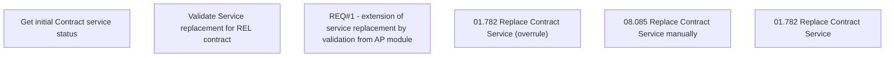

# CBL-9632 (CLM-2981) FLIP eligibility validation in AP

```mermaid
graph TD
    Get_initial_Contract_service_status["Get initial Contract service status"]
    Validate_Service_replacement_for_REL_contract["Validate Service replacement for REL contract"]
    REQ_1_extension_of_service_replacement_by_validation_from_AP["REQ#1 - extension of service replacement by validation from AP module"]
    n_01_782_Replace_Contract_Service_overrule["01.782 Replace Contract Service (overrule)"]
    n_08_085_Replace_Contract_Service_manually["08.085 Replace Contract Service manually"]
    n_01_782_Replace_Contract_Service["01.782 Replace Contract Service"]
```
