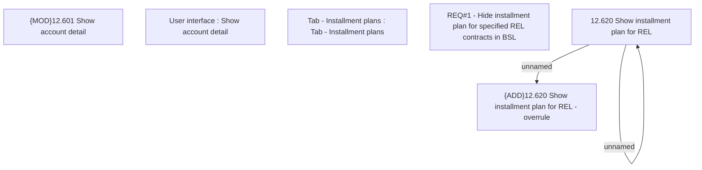

# CBL-9725 (CLM-2983) Hide installment plan for REL contracts in BSL

```mermaid
graph TD
    MOD_12_601_Show_account_detail["{MOD}12.601 Show account detail"]
    User_interface_Show_account_detail["User interface : Show account detail"]
    ADD_12_620_Show_installment_plan_for_REL_overrule["{ADD}12.620 Show installment plan for REL - overrule"]
    Tab_Installment_plans_Tab_Installment_plans["Tab - Installment plans : Tab - Installment plans"]
    REQ_1_Hide_installment_plan_for_specified_REL_contracts_in_B["REQ#1 - Hide installment plan for specified REL contracts in BSL"]
    n_12_620_Show_installment_plan_for_REL["12.620 Show installment plan for REL"]
    n_12_620_Show_installment_plan_for_REL["12.620 Show installment plan for REL"]
    n_12_620_Show_installment_plan_for_REL -->|unnamed| n_12_620_Show_installment_plan_for_REL
    n_12_620_Show_installment_plan_for_REL -->|unnamed| ADD_12_620_Show_installment_plan_for_REL_overrule
```
