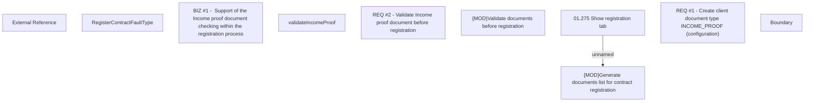

# CBL-9757 (CLM-3028) Check Income proof document

- **Diagram Type**: Custom
- **Package**: HomerSelect/BSL/Requirements Model/Finished/CLM/CBL-9757 (CLM-3028) Check Income proof document
- **Diagram ID**: 144782
- **Elements**: 10
- **Connectors**: 1

