# CBL-9759 (CLM-3060) Create API for Loan restructuring

- **Diagram Type**: Custom
- **Package**: HomerSelect/BSL/Requirements Model/Finished/CLM/CBL-9759 (CLM-3059) Create API for Loan restructuring
- **Diagram ID**: 144802
- **Elements**: 20
- **Connectors**: 12

```mermaid
graph TD
    Use_Case_Model_Loan_restructuring_request_creation_externall["Use Case Model : Loan restructuring request creation - externally"]
    Use_Case_Model_Loan_restructuring_request_creation_via_GUI["Use Case Model : Loan restructuring request creation - via GUI"]
    Contract_LRES_Service_Requests_Contract_LRES_Service_Request["Contract LRES Service Requests : Contract LRES Service Requests - confirm offer"]
    Contract_LRES_Service_Requests_Contract_LRES_Service_Request["Contract LRES Service Requests : Contract LRES Service Requests - get offer"]
    Contract_LRES_Service_Requests_Contract_LRES_Service_Request["Contract LRES Service Requests : Contract LRES Service Requests - create request"]
    REQ_2_new_REST_API_for_LRES_create_request_get_offers_and_co["REQ#2 - new REST API for LRES create request, get offers and confirm offer"]
    REQ_1_Extract_common_part_of_existing_LRES_functionalities_t["REQ#1 - Extract common part of existing LRES functionalities to allow shared usage from GUI and API"]
    ADD_Check_ContractLRESRequest_input_parameters["{ADD}Check ContractLRESRequest input parameters"]
    n_01_812_Confirm_ContractLRESRequest_offer_service["01.812 Confirm ContractLRESRequest offer service"]
    n_01_811_Get_ContractLRESRequest_offer_service["01.811 Get ContractLRESRequest offer service"]
    n_01_810_Create_ContractLRESRequest_service["01.810 Create ContractLRESRequest service"]
    n_01_812_Confirm_ContractLRESRequest_offer_service["01.812 Confirm ContractLRESRequest offer service"]
    n_01_811_Get_ContractLRESRequest_offer_service["01.811 Get ContractLRESRequest offer service"]
    n_01_810_Create_ContractLRESRequest_service["01.810 Create ContractLRESRequest service"]
    ADD_08_405_Confirm_offer_for_loan_restructuring_common["{ADD}08.405 Confirm offer for loan restructuring common"]
    MOD_08_405_Confirm_offer_for_loan_restructuring_common["{MOD}08.405 Confirm offer for loan restructuring common"]
    MOD_08_403_Create_request_for_loan_restructuring_common["{MOD}08.403 Create request for loan restructuring common"]
    ADD_08_403_Create_request_for_loan_restructuring_common["{ADD}08.403 Create request for loan restructuring common"]
    n_08_404_Confirm_offer_for_loan_restructuring["08.404 Confirm offer for loan restructuring"]
    n_08_402_Create_request_for_loan_restructuring["08.402 Create request for loan restructuring"]
    n_01_811_Get_ContractLRESRequest_offer_service -->|unnamed| ADD_Check_ContractLRESRequest_input_parameters
    n_01_811_Get_ContractLRESRequest_offer_service -->|unnamed| n_01_811_Get_ContractLRESRequest_offer_service
    n_01_810_Create_ContractLRESRequest_service -->|unnamed| MOD_08_403_Create_request_for_loan_restructuring_common
    n_01_810_Create_ContractLRESRequest_service -->|unnamed| ADD_Check_ContractLRESRequest_input_parameters
    n_01_810_Create_ContractLRESRequest_service -->|unnamed| n_01_810_Create_ContractLRESRequest_service
    n_01_812_Confirm_ContractLRESRequest_offer_service -->|unnamed| MOD_08_405_Confirm_offer_for_loan_restructuring_common
    n_01_812_Confirm_ContractLRESRequest_offer_service -->|unnamed| ADD_Check_ContractLRESRequest_input_parameters
    n_01_812_Confirm_ContractLRESRequest_offer_service -->|unnamed| n_01_812_Confirm_ContractLRESRequest_offer_service
    MOD_08_405_Confirm_offer_for_loan_restructuring_common -->|unnamed| ADD_08_405_Confirm_offer_for_loan_restructuring_common
    n_08_404_Confirm_offer_for_loan_restructuring -->|unnamed| MOD_08_405_Confirm_offer_for_loan_restructuring_common
    n_08_402_Create_request_for_loan_restructuring -->|unnamed| MOD_08_403_Create_request_for_loan_restructuring_common
    MOD_08_403_Create_request_for_loan_restructuring_common -->|unnamed| ADD_08_403_Create_request_for_loan_restructuring_common
```

